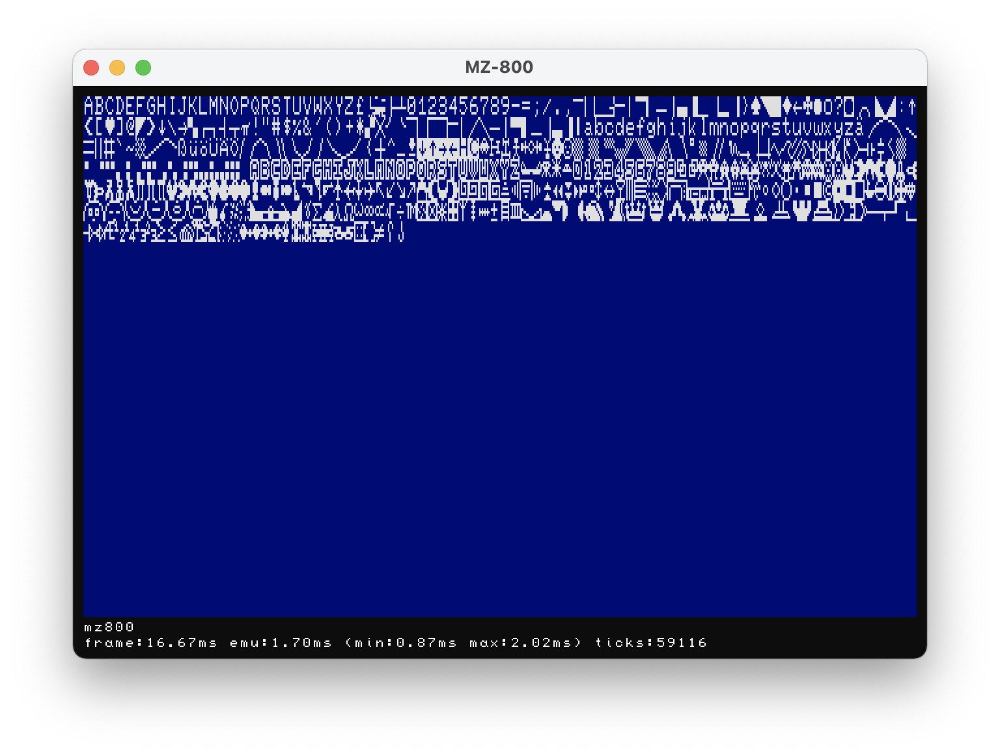

# mz-800-emulator

SHARP MZ-800 Emulator using Andre Weissflog's https://github.com/floooh/chips emulator infrastructure.

**NOTE:** The emulator doesn't come with ROMs included since I think they're still copyrighted material. You need to provide your own copy of ROMs or use the emulator without.

**NOTE:** This project has just been started, so don't expect anything useful yet.

Build and run (exact versions of tools don't matter):

```bash
> python --version
Python 2.7.10
> cmake --version
cmake version 3.10.0
> ./fips build
...
> ./fips list targets
...
> ./fips run [target]
...
```

To get optimized builds for performance testing:

```bash
# on OSX:
> ./fips set config osx-make-release
> ./fips build
> ./fips run [target]

# on Linux
> ./fips set config linux-make-release
> ./fips build
> ./fips run [target]

# on Windows
> fips set config win64-vstudio-release
> fips build
> fips run [target]
```

To open project in IDE:
```bash
# on OSX with Xcode:
> ./fips set config osx-xcode-debug
> ./fips gen
> ./fips open

# on OSX with Xcode for creating unit tests using XCTest:
# (Coverage logging not enabled, you need to edit scheme in Xcode to enable)
> ./fips set config osx-xcode-xctest
> ./fips gen
> ./fips open

# on Windows with Visual Studio:
> ./fips set config win64-vstudio-debug
> ./fips gen
> ./fips open

# experimental VSCode support on Win/OSX/Linux:
> ./fips set config [linux|osx|win64]-vscode-debug
> ./fips gen
> ./fips open
```

